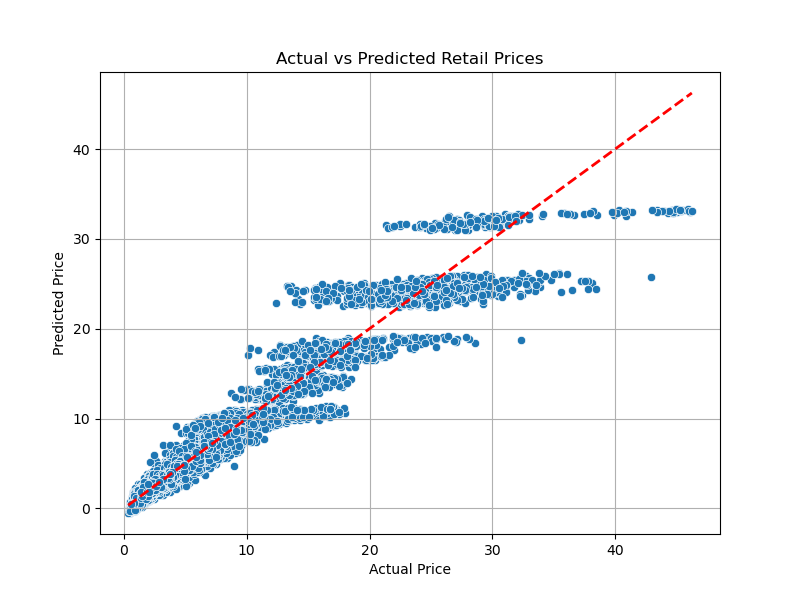

# Retail Price Prediction Using Machine Learning

This project analyses historical Canadian retail pricing data (2017–2025) to build and evaluate supervised learning models for estimating **pre‑tax product prices**.  The dataset comes from the [Product Retail Price Survey 2017–2025](https://www.kaggle.com/datasets/aradhanahirapara/product-retail-price-survey-2017-2025) on Kaggle, collected by *Aradhana Hirapara*.  In the source data the target variable is named `VALUE`, which represents the **pre‑tax price** of each product; we retain this naming for consistency with the original survey.

## 🎯 Project Goal

The primary objective is to predict the `VALUE` (pre‑tax price) of retail goods based on features such as date, province, product category and tax structure.  This project showcases an end‑to‑end workflow—from cleaning and visualisation to modelling and evaluation—making it a strong portfolio piece for data‑analytics roles.

## 📊 Data Overview

- **Source:** [Product Retail Price Survey 2017–2025 (Kaggle)](https://www.kaggle.com/datasets/aradhanahirapara/product-retail-price-survey-2017-2025)
- **Attributes:** Year, month, province (`GEO`), product category, specific product, whether the item is taxable or essential, total tax rate and the pre‑tax price (`VALUE`).
- **Target:** `VALUE` – the pre‑tax price of the item (e.g. $4.72 in 2017).  We leave the column name unchanged to respect the dataset’s schema.

## 🧐 Modelling & Results

Two regression models were trained to predict prices.  While both performed well, **Linear Regression** achieved slightly better accuracy on this dataset.

| Metric | ✅ Linear Regression (Best) | Random Forest |
| :--- | :--- | :--- |
| **RMSE** | 1.24 | 1.36 |
| **R²** | 0.94 | 0.93 |

- **RMSE (Root Mean Squared Error):** Average prediction error in dollars (lower is better).
- **R² Score:** Percentage of price variance explained by the model (closer to 1.0 is better).



## 🔍 Key Findings & Visualisations

- **Price inflation:** Average prices rose steadily from **$4.72 in 2017** to **$6.44 in 2025**, indicating a clear inflationary trend.
- **Tax rate variation:** Provinces 2–6 had the highest average tax rates (~15 %), while province 10 had the lowest (~5 %).
- **Most expensive items:** Premium beef cuts and infant formula consistently topped the list of most expensive products.
- **Category spread:** ‘Meat & Poultry’ and ‘Infant & Baby Products’ showed the greatest price variability and outliers.

All visualisations (distribution plots, tax comparisons, top‑product charts and predicted vs actual) are saved in the `plots/` folder.

## 🤖 Machine‑Learning Workflow

1. **Preprocessing:** Cleaned the dataset and converted categorical features (e.g. `GEO`, `Product`, `Category`) into numerical form using one‑hot encoding.
2. **Feature selection:** Used `Year`, `Month`, `GEO`, `Product Category`, `Products`, `Taxable`, `Essential`, and `Total Tax Rate` as predictors.
3. **Model training:** Split the data (80 % train, 20 % test) and trained models using `LinearRegression()` and `RandomForestRegressor()`.
4. **Evaluation:** Assessed performance using RMSE and R² on the unseen test set.
5. **Next steps:** Consider hyperparameter tuning for the Random Forest, feature engineering (e.g., seasonal indicators) and deployment of the best model as a simple API or web app.

## 💽 Project Structure

```
Retail-Price-Prediction/
├── Retail_Project.ipynb               # Main Jupyter notebook
├── README.md                          # Project summary (this file)
├── requirements.txt                   # Python dependencies
├── summary.txt                        # Short findings summary
├── data/
│   ├── Retail_Prices_of_Products.csv  # Full dataset (cleaned)
│   └── Data_Dictionary.txt            # Column descriptions
├── plots/
│   ├── PriceDistributionByCategory.png
│   ├── TaxRateByProvince.png
│   ├── TopMostExpensiveItems.png
│   ├── AveragePriceOverTime.png
│   └── PredictedVSActual.png
└── LICENSE
```

## 🚀 How to Run

```bash
git clone https://github.com/arun-data-analyst/Retail-Price-Prediction.git
cd Retail-Price-Prediction
pip install -r requirements.txt
jupyter notebook Retail_Project.ipynb
```

## 👤 Author

**Arun Acharya**
*Ottawa, Canada*
*Data Analyst*

---

*Enjoyed this project? Check out my other work on [GitHub](https://github.com/arun-data-analyst) and connect with me on [LinkedIn](https://www.linkedin.com/in/arun-acharya-26077a362).*
